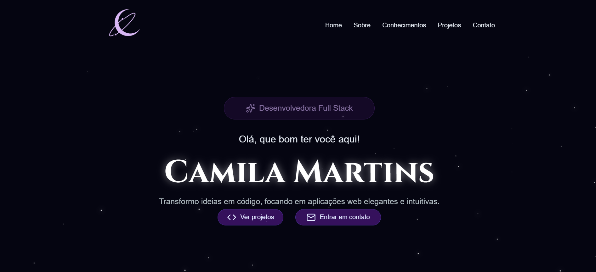

# 🌌 Portfólio Pessoal | Camila

<h4 align="center">
  <a href="https://villainitt.github.io/portifolio/">Clique aqui para acessar o projeto</a>
</h4>

---

## 💻 Sobre

Projeto desenvolvido para apresentação pessoal e de projetos.

## O site é composto por:

- **Hero:** Apresentação;
- **Sobre Mim:** Pequeno resumo sobre minha jornada;
- **Skills:** Tecnologias;
- **Projetos:** Vitrine dos meus projetos;
- **Contato:** Área com links diretos para e-mail e redes sociais.

## 🧠 Tecnologias utilizadas:

O projeto foi construído utilizando o ecossistema moderno do React:

    
    
    
    

## 📚 Alguns conceitos aplicados

Neste projeto apliquei os seguintes pontos técnicos:
+ **Componentização:** Interface dividida em blocos reutilizáveis (Cards, Navbar, Sections);
+ **Hooks do React:** Uso de `useState` e `useEffect` para gerenciar o fundo estrelado e dados;
+ **Renderização Dinâmica:** Listas geradas automaticamente via `.map()` através de arquivos TypeScript;
+ **CSS Animations:** Efeitos de brilho (Glow), keyframes personalizados e glassmorphism;
+ **Responsividade:** Layout adaptável para mobile e desktop.

---

<table>
  <tr>
    <td>
      Feito com 💜 por <a href="https://github.com/Villainitt/">Camila</a>.
    </td>
  </tr>
</table>
